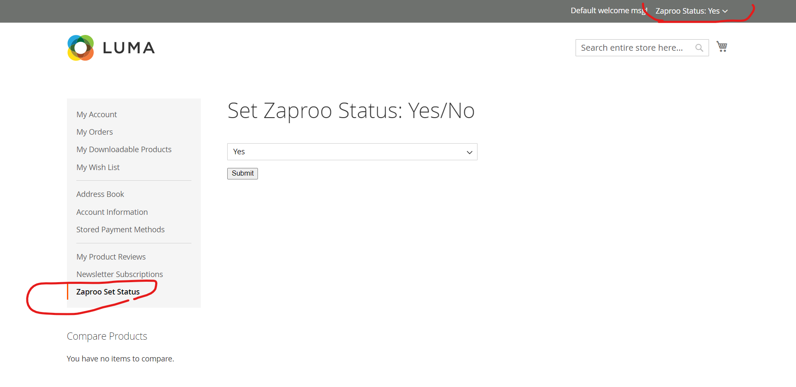
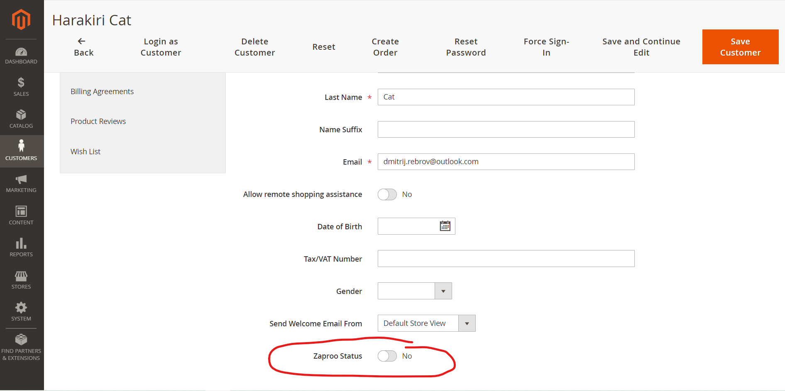

# Magento 2 Zaproo status module

## The task (⊙_⊙;)
```text
Frontend:
1) in customer account add a new link to menu
2) when opening the link, show a form with one field "Status" and button "Save"
3) when a customer fills in the status and presses the save button, the status gets saved
4) the status must be displayed in the top right corner. Right after the welcome message.
5) it must work correctly with all the caches enabled
Backend:
1) The saved status must be displayed in admin in customer edit page.
2) Admin can change the status

```
## Stack
* Magento 2.4.1
* php 7.4.3

## Install
bin/magento module:enable Funami_Zaproo  
bin/magento s:up  
bin/magento s:di:c  


## Known issues
* frontend form could be done through ui_component
* Customer attribute could be done through RepositoryModel or DataPatchInterface/PatchRevertableInterface
* Localization missing
* Styling issues. There is codesniffer broken in phpstorm 2020.3.0 :(

## Author comments
Done as quick and simple as possible. Just demonstration.

## Sceenshots


